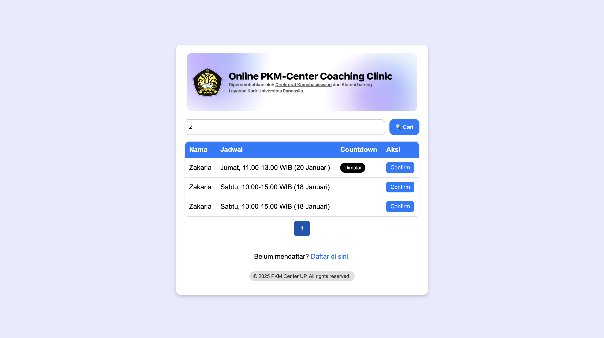

# ⏰ Waiting List Zoom Meeting PKM ⏰



Welcome to **Waiting List Zoom Meeting PKM**, a project designed to manage Zoom meeting waitlists efficiently. Built with simplicity and functionality in mind, this project is a perfect tool for handling participant data, countdown timers, and quick actions in a user-friendly interface.

---

## 🚀 About Me

Hi there! 👋 I'm **Nawawi Megahertz**, an **IoT Engineer** and **Frontend Enthusiast** passionate about crafting elegant, responsive, and impactful solutions for the modern IoT to web. Let's connect and build something amazing together!

---

## 🛠️ Features

- **Search Functionality**: Quickly find participants by name.
- **Countdown Timer**: Live countdowns for upcoming events.
- **Pagination**: Easy navigation through long lists.
- **Confirmation System**: Interactive popups for confirming participation.
- **Responsive Design**: Seamless experience across devices.
- **Dynamic Data Fetching**: Fetches participant data, including names, schedules, and passwords, directly from a **Google Sheet** using a custom Google Apps Script backend.

---

## 🧩 Code Highlights

Here are some code snippets showcasing the project's core functionality:

### ⏳ Countdown Timer
```javascript
function updateCountdown(chipId, time) {
    const eventDate = new Date(time);
    const updateChip = () => {
        const now = new Date();
        const diff = eventDate - now;

        const chip = document.getElementById(chipId);
        if (!chip) return;

        if (diff <= 0) {
            chip.textContent = 'Dimulai';
            chip.className = 'chip black';
            clearInterval(intervalIds[chipId]);
        } else {
            const hours = Math.floor(diff / (1000 * 60 * 60));
            const minutes = Math.floor((diff % (1000 * 60 * 60)) / (1000 * 60));
            const seconds = Math.floor((diff % (1000 * 60)) / 1000);

            chip.textContent = `${hours}h ${minutes}m ${seconds}s`;
            chip.className = 'chip green';
        }
    };
    intervalIds[chipId] = setInterval(updateChip, 1000);
    updateChip();
}
```

### 🔎 Search Functionality
```javascript
function searchData() {
    const searchValue = document.getElementById('search').value.toLowerCase();

    if (searchValue === '') {
        fetchData();
        return;
    }

    const filteredData = tableData.filter(item => item.name.toLowerCase().includes(searchValue));
    if (filteredData.length > 0) {
        tableData = filteredData;
        renderTable();
    } else {
        alert('No matching data found!');
    }
}
```

---

## 🌐 Data Integration

All participant data, including names, times, and passwords, are dynamically fetched from a **Google Sheet** using a backend powered by Google Apps Script. 

### ✅ Backend Code
The following Google Apps Script powers the backend for this project:

```javascript
function doGet() {
  const sheet = SpreadsheetApp.getActiveSpreadsheet().getActiveSheet();
  const data = sheet.getDataRange().getValues();

  // Index kolom: [0]=name, [1]=password, [2]=time, ...
  const filteredData = data.slice(1).filter(row => {
    // Minimal kolom name (row[0]) dan time (row[2]) diisi
    const nameNotEmpty = row[0].toString().trim().length > 0;
    const timeNotEmpty = row[2].toString().trim().length > 0;
    return nameNotEmpty && timeNotEmpty;
  });

  const result = filteredData.map((row) => ({
    name: row[0],
    password: row[1],
    time: row[2],
    status: row[3],
    zoomLink: row[4]
  }));
  return ContentService.createTextOutput(JSON.stringify(result)).setMimeType(ContentService.MimeType.JSON);
}
```

### ✅ Adding Backend Code to Google Sheet

To add the backend code:

1. Open my **Google Sheet**: [Link to Sheet](#).
2. Go to **Extensions > Apps Script**.
3. Copy and paste the above code into your script editor.
4. Save the script with a name like `doGet API`.
5. Deploy the script as a **Web App**:
   - Click on **Deploy > New Deployment**.
   - Select **Web App**.
   - Set **Execute as** to `Me` and **Who has access** to `Anyone`.
   - Click **Deploy** and copy the deployment URL.
6. Replace the `sheetApiUrl` in your project with the deployment URL.

---

## 🌐 Deployment

Easily deploy this project on **Vercel** by following these steps:

1. Clone the repository:
   ```bash
   git clone https://github.com/nawawimegahertz/waiting-list-zoom-meeting-pkm.git
   ```
2. Navigate to the project directory:
   ```bash
   cd waiting-list-zoom-meeting-pkm
   ```
3. Push the repository to a new Vercel project:
   ```bash
   vercel deploy
   ```
4. Share your live project link with others!

---

## 🎨 Design Highlights

- Modern and minimalistic layout.
- Intuitive color scheme for better accessibility.
- Fully responsive for mobile, tablet, and desktop users.

---

## 🤯 Keep in Update

Loved the project? Want to contribute or share feedback?

👉 **[Visit the Repository](https://github.com/nawawimegahertz/waiting-list-zoom-meeting-pkm)**

👉 **[Check Live Demo](https://virtual-pkmcenterup.vercel.app/)**

💬 Feel free to reach out with your ideas or suggestions!

---

## 🪪 License

This project is licensed under the [MIT License](./LICENSE).

---

Happy coding! ✨
